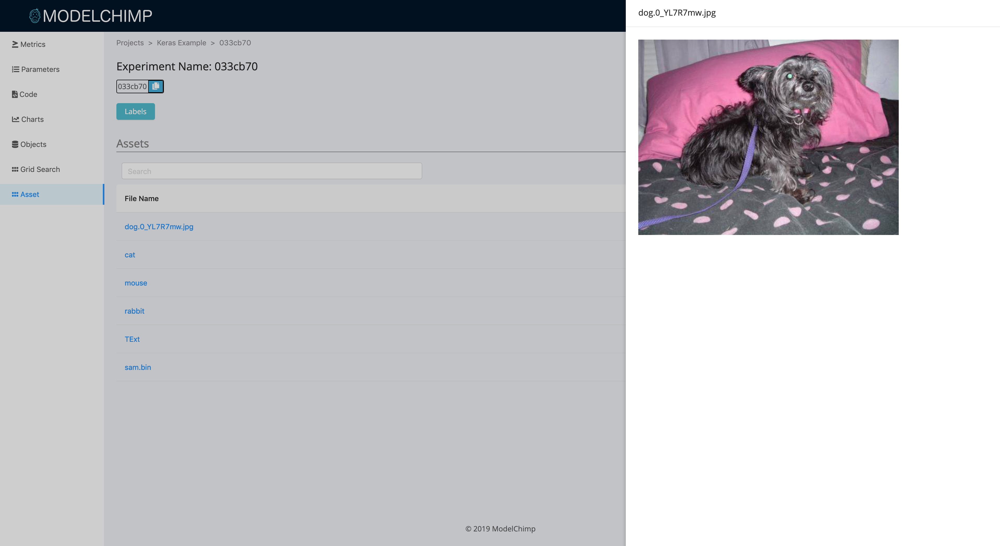

# Asset

## Storing
The following file types can be stored.

1. Image - 'jpg', 'bmp', 'jpeg', 'png', 'gif', 'svg'
2. Text - 'txt', 'log', 'yaml', 'yml', 'json', 'csv', 'tsv', 'md', 'rst'
3. Model - 'pickle', 'bin', 'h5'

[add_asset](../track.md#add_asset)

Example

```python
tracker.add_asset("dog.png", {'accuracy': accuracy})
```

## Viewing
The asset stored for an experiment can be viewed by clicking on “Asset” tab in the experiment page


