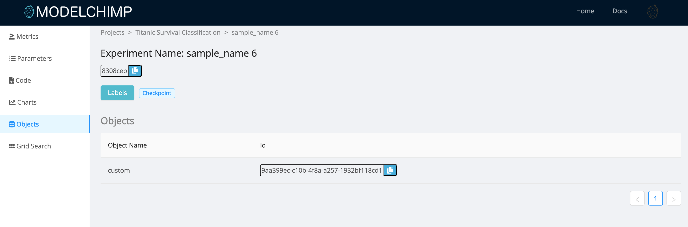

# Custom Objects

## Storing
Any python object of an experiment such as data objects, model object etc can be stored in ModelChimp by using the following method of Tracker class

[add_custom_objects](../track.md#add_custom_objects)

Example

```python
data = pd.read_csv(‘data/train.csv’)
tracker.add_custom_object(“train data”, data)
```

## Viewing
The custom objects stored for an experiment can be viewed by clicking on “Custom Objects” button in the experiment page



## Pulling
The custom objects can be reused in another experiment by using the following method of Tracker Class to pull it from ModelChimp server

The “ID” of the custom object has to be copied from the Custom Objects page in the above method.

[pull_custom_object](../track.md#pull_custom_object)

Example

```python
data = pull_custom_object(‘855d12a4-333b-453b-bd63-2d27942846d5’)
```
