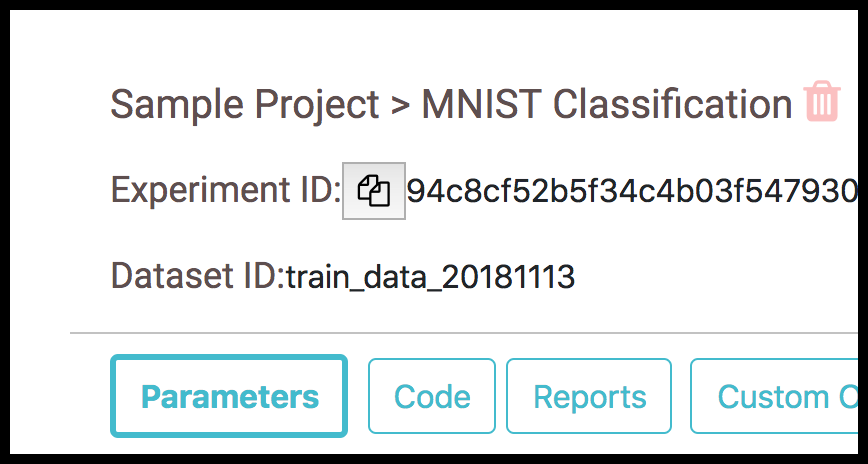

# Add Dataset Id

A dataset id can be captured for each experiment with the help of the following method of Tracker class.

[add_dataset_id(id)](../track.md#add_dataset_id)

The dataset will be displayed in the experiment page as follows

