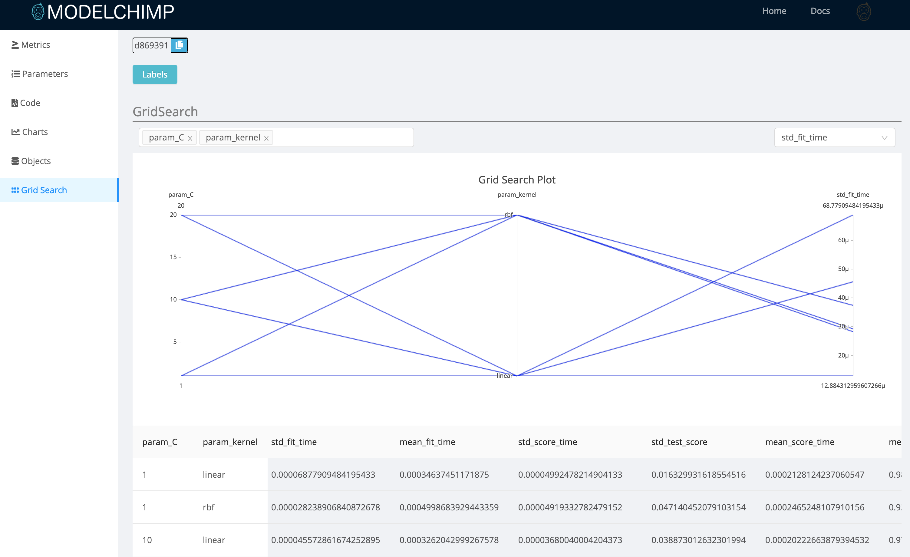

# GridSearch

The result of Sklearn's GridSearchCV can be captured with the following Tracker class method

  * [add_gridsearch](../track.md#add_gridsearch)

The data captured by this methods can be viewed at ModelChimp server by clicking on the GridSearch Tab for the respective experiment.

