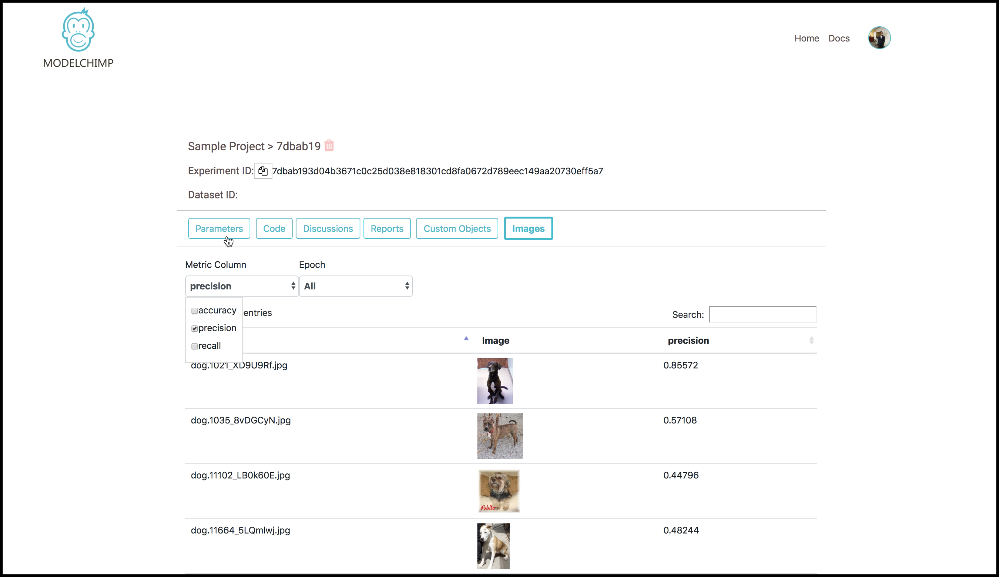

# Images

For computer vision based experiments, it's useful to store the predictions on the test and validation images along with the images itself. The post-experiment forensics on the prediction of these images can be viewed by clicking on “Images” button in the experiment page.

The following method is used for storing the images along with the associated metric.

[add_image(filepath, metric_dict=None, custom_file_name=None, epoch=None)](../track.md#add_image)

The images stored in the experiment will look like as follows

