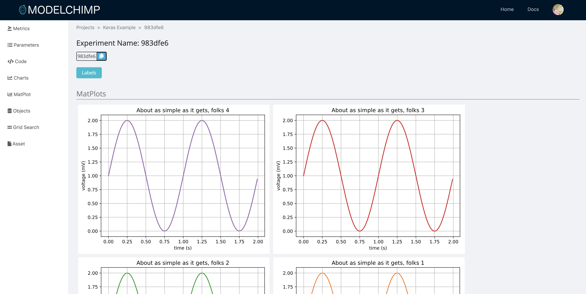

# Matplot

## Storing
Any Matplot chart can be stored by using the following method of Tracker class

[add_mat_plot](../track.md#add_mat_plot)

Example

```python
...

def get_matplot():
    t = np.arange(0.0, 2.0, 0.01)
    s = 1 + np.sin(2*np.pi*t)
    plt.plot(t, s)

    plt.xlabel('time (s)')
    plt.ylabel('voltage (mV)')
    plt.title('About as simple as it gets, folks')
    plt.grid(True)
    plt.savefig("test.png")

    return plt

tracker.add_mat_plot("Test Plot", get_matplot())

...
```

## Viewing
The Matplot charts for an experiment can be viewed by clicking on “Matplot” tab in the experiment page


