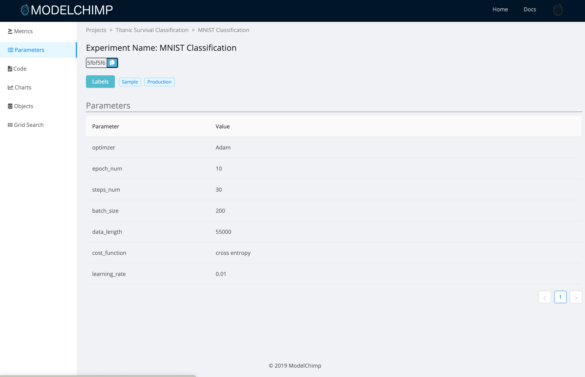

# Adding/Viewing Parameters and Metrics

The parameters and metrics of an experiment can be captured with the following Tracker class methods.

  1. [add_param](../track.md#add_param)
  2. [add_multiple_params](../track.md#add_multiple_params)
  3. [add_metric](../track.md#add_metric)
  4. [add_multiple_metrics](../track.md#add_multiple_metrics)

The data captured by these methods can be viewed at ModelChimp server by clicking on the experiment for which the data was captured.

