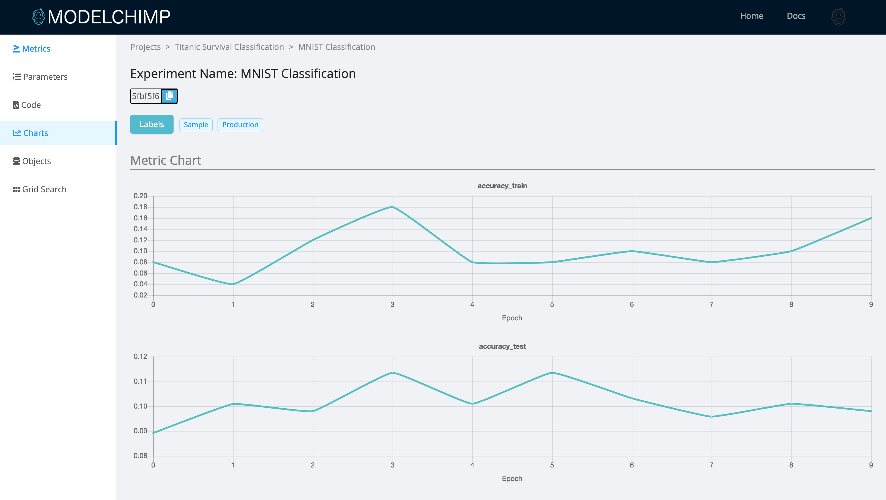

# Experiment Reports

For deep learning experiments, there are two types of epoch level reports which can be viewed by clicking on the “Reports” button in the experiment page.

To capture the data for this report, you’ll have to set the epoch arguments in the following Tracker class methods

* Epoch Metric Report
    * [add_metric(metric_name, metric_value, epoch=None)](../track.md#add_metric)
    * [add_multiple_metrics(metrics_dict, epoch=None)](../track.md#add_multiple_metrics)
* Epoch Duration Report
    * [add_duration_at_epoch(self, tag, seconds_elapsed, epoch)](../track.md#add_duration_at_epoch)
