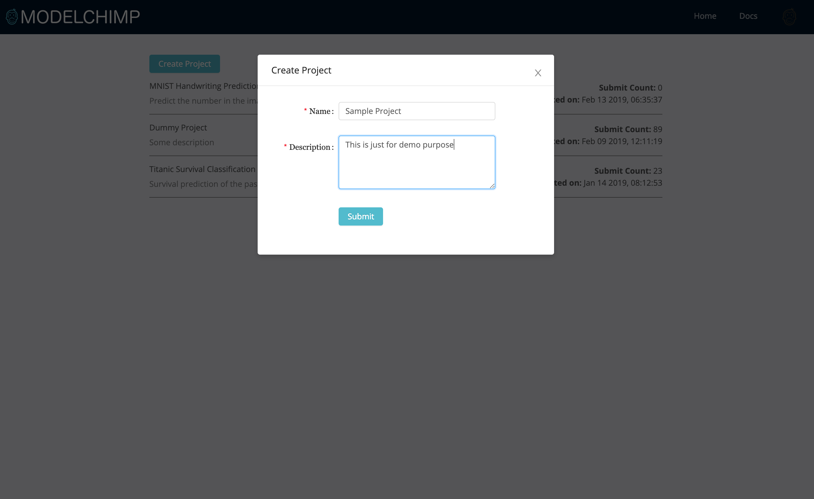
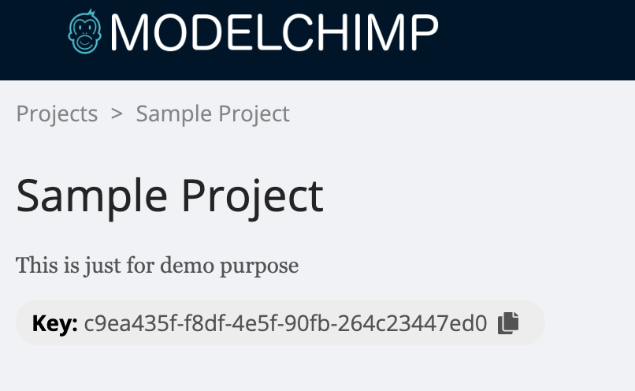

# Getting Started
* Login into ModelChimp server

  
  <br><br>

* Create a project

  
  <br><br>

* Clone one of the example projects from [GitHub](https://github.com/ModelChimp/). We shall make use of the Keras sample project

```sh
  git clone https://github.com/ModelChimp/keras_example   
```
<br>

* Copy the project key from the project page and add it to the Tracker class in the Keras example code


<br><br>

```python
tracker = Tracker('114cda96-ad7a-4674-ac01-81b8093f97b4',
                  host='localhost:8000',
                  experiment_name='MNIST Classification')
```
<br>

* Execute the code

```sh
python main.py
```


<br><br>

* The experiment will be live and can be viewed on ModelChimp server


