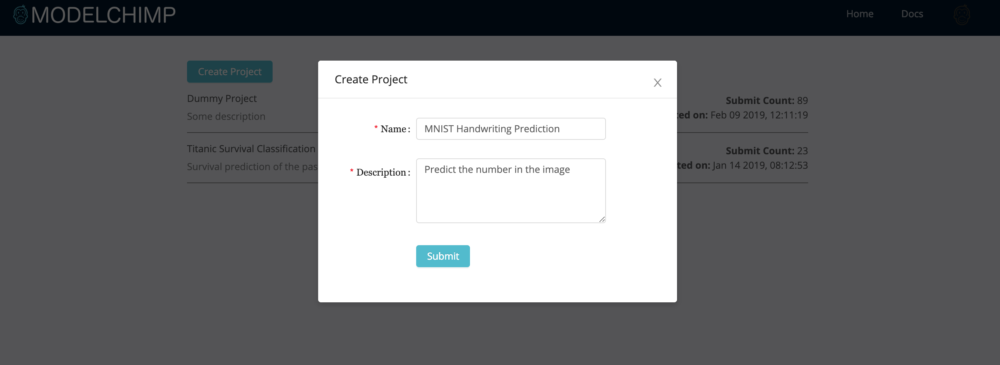
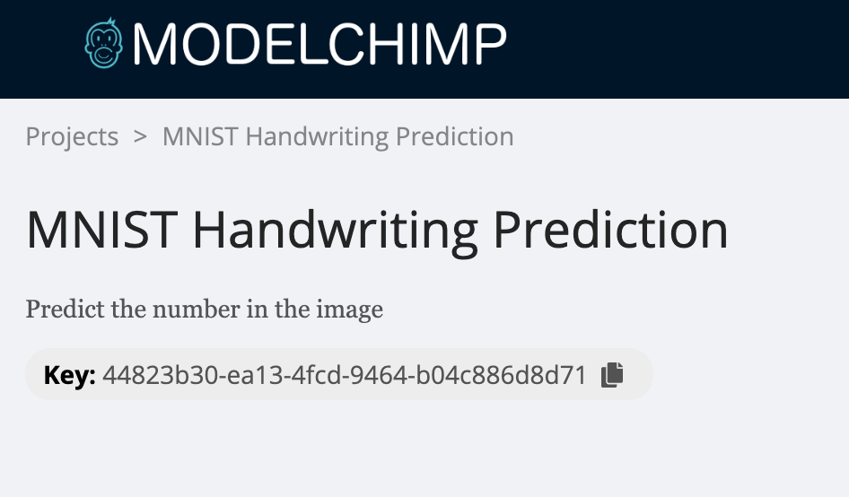

# Welcome to ModelChimp

Machine learning practitioners should focus on experiments and not on managing them.

## Installation
Install ModelChimp by executing the following command in the terminal

    pip3 install modelchimp

## Define the project
Name your project and give a description at the home page after registration.

Copy the project key from project page.

## Add the Tracker

Add the following tracker code to your python script and call the required methods of the Tracker Class.
[Find more details here](./track.md)

    from modelchimp import Tracker

    # Add before the trained model
    tracker = Tracker(key='<PROJECT KEY>',
                      host='<host>',
                      experiment_name=None,
                      tracking=True,  
                      auto_log=False,
                      existing_exp_id=None)

    tracker.add_param(...)
    tracker.add_metric(...)
