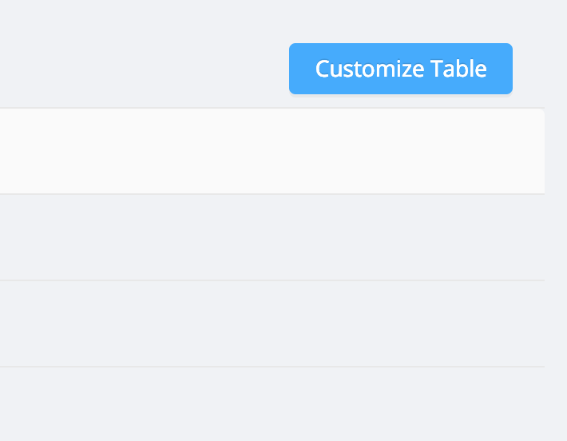
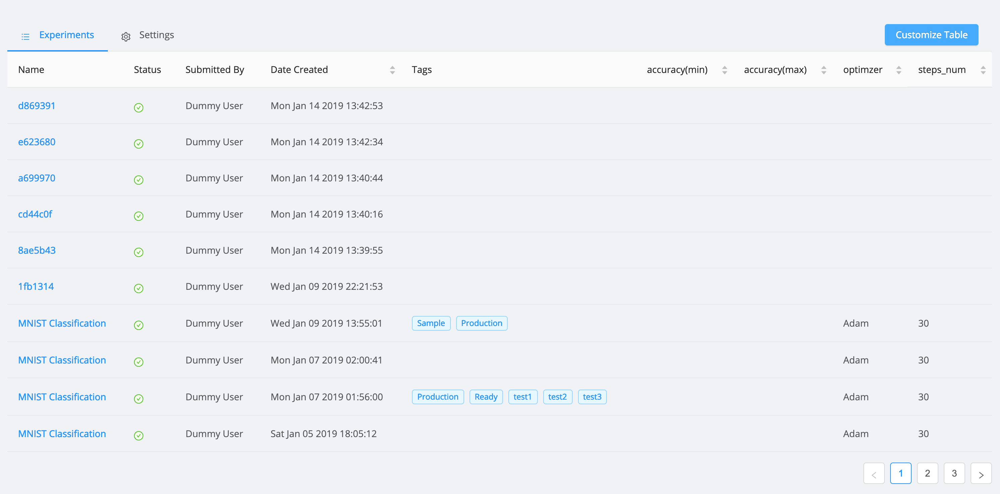

# Customizing Experiment Table

The experiment table in the project page can be customized to include the parameter values of the experiments. You can click on the Customize button and select the parameters that need to be displayed

