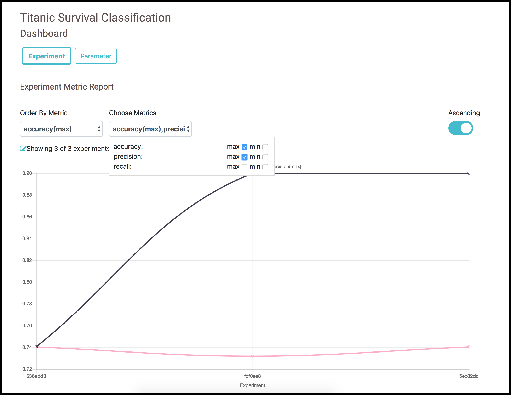

# Project Dashboard

Project dashboard is super useful for comparing evaluation metrics across experiments. The dashboard can be accessed by clicking on the dashboard button in the project page.

  

Choose the baseline metric based on which the experiments need to be compared by clicking on “Order by metric”

  

Choose other metrics that need to be compared by clicking on the “Choose Metrics“

  

The experiments can be further filtered as top or bottom 5 experiments by clicking on the asc/desc button and “number of experiment” button

  
