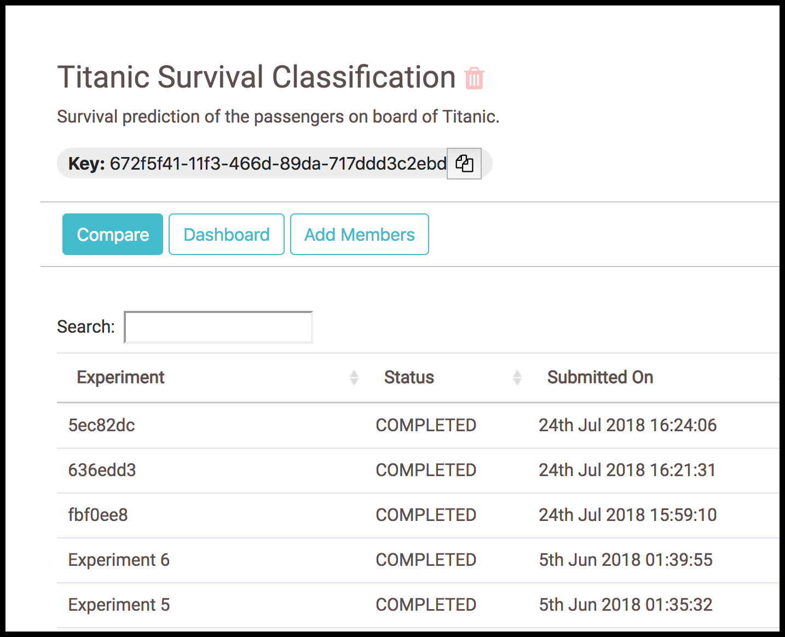
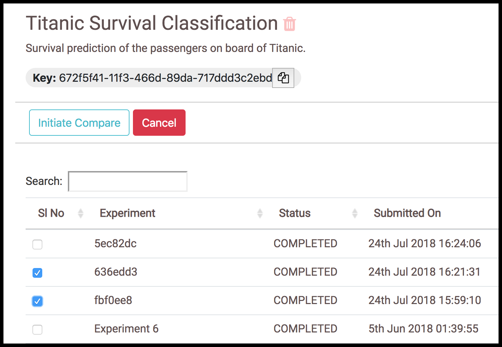
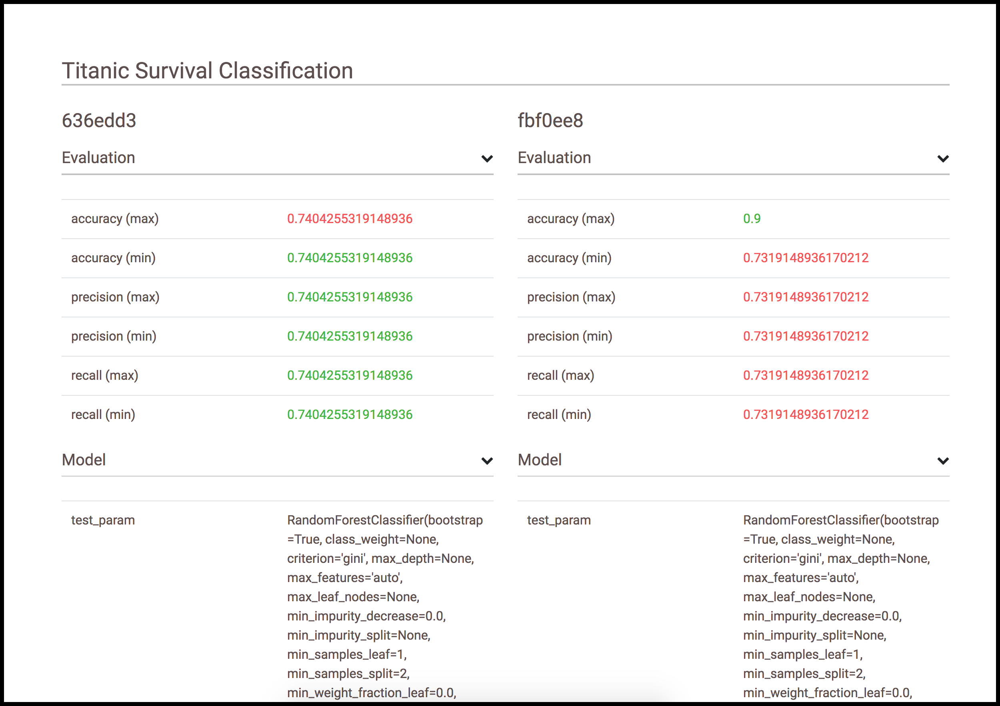

# Experiment Comparison

Two experiments within a project can be compared by click on the Compare button in the project page.

  

After clicking on Compare, choose two experiments and then click on Initiate Compare

  

The two experiments can be viewed side by side as seen in the image below

