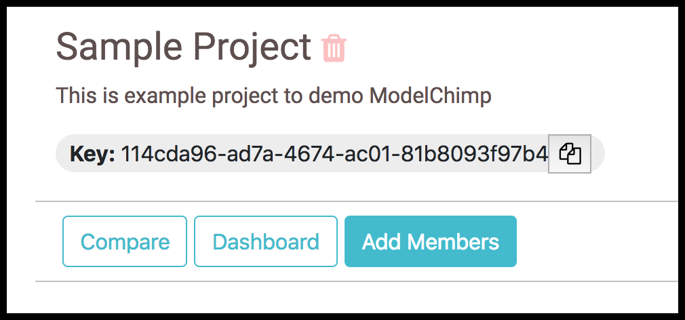
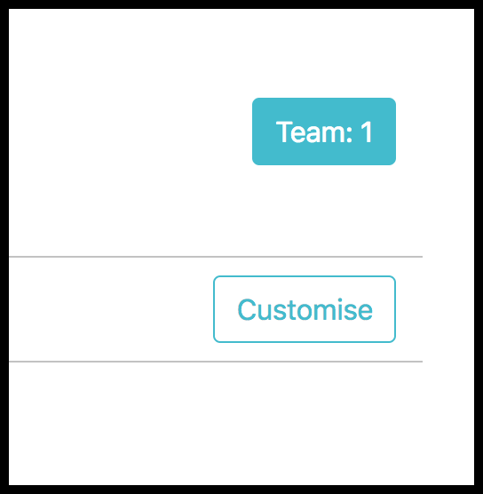

# Adding and viewing members

## Adding

Members can be added to your project by clicking on the "Settings" in the project page and then clicking on Members

> NOTE: This feature is enabled only if the email service credentials are provided while setting up the ModelChimp server

## Viewing

Members who are part of the project can also be viewed by clicking on the Team button in the project page

